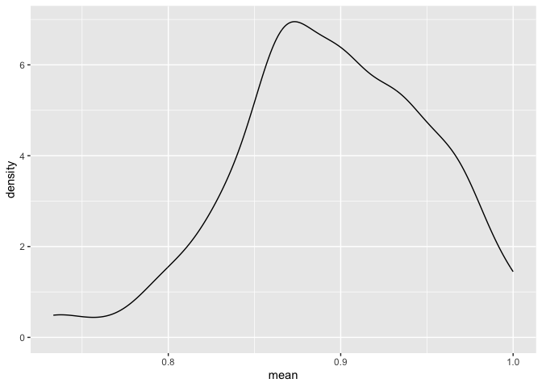
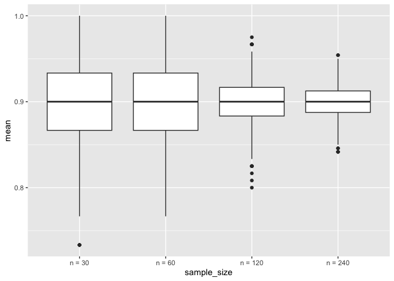
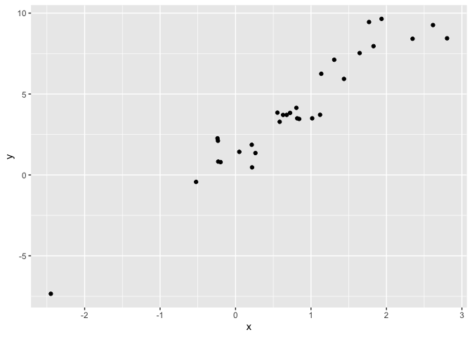
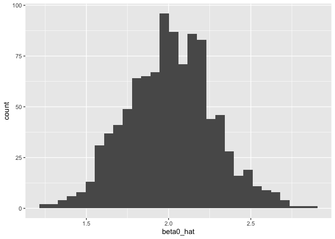
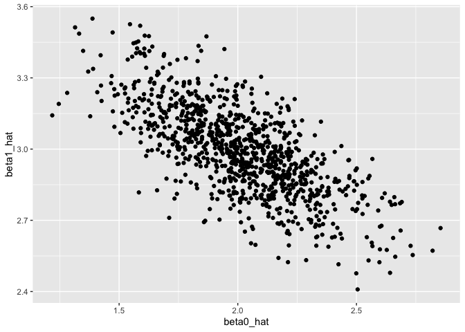

Simulation
================

``` r
sim_mean_sd = function(n_obs, true_p = .9) {
  
  x_vec = rbinom(n = n_obs, size = 1, prob = true_p)
  
tibble(
  mean = mean(x_vec), 
  sd = sd(x_vec))
 
}
```

``` r
sim_mean_sd(n_obs = 30)
```

    ## # A tibble: 1 × 2
    ##    mean    sd
    ##   <dbl> <dbl>
    ## 1     1     0

Let’s iterate to see how this works under repeated sampling!!

``` r
output = vector("list", 100)

for (i in 1:100) {
  output[[i]] = sim_mean_sd(30)
}

sim_results = bind_rows(output)

sim_results |> 
  ggplot(aes(x = mean)) + geom_density()
```

<!-- -->

``` r
sim_results |>
  summarize(
    mu_hat = mean(mean),
    sd_hat = sd(mean)
  )
```

    ## # A tibble: 1 × 2
    ##   mu_hat sd_hat
    ##    <dbl>  <dbl>
    ## 1  0.895 0.0564

use a map function

``` r
sim_results_df = 
  expand_grid(
    sample_size = c(30, 60, 120, 240),
    iter = 1:1000
  ) |>
  mutate(estimate_df = map(sample_size, sim_mean_sd)) |>
  unnest(estimate_df)

sim_results_df |>
  mutate(
    sample_size = str_c("n = ", sample_size),
    sample_size = fct_inorder(sample_size)
  ) |>
  ggplot(aes(x = sample_size, y = mean)) + geom_boxplot()
```

<!-- -->

## SLR

Goal is to write a function that simulates data and then fits a
regression; then repeat to look at the distribution of estimated
coefficients.

``` r
beta_0 = 2
beta_1 = 3

sim_data = 
  tibble(
    x = rnorm(n = 30, mean = 1, sd = 1),
    y = beta_0 + beta_1 * x + rnorm(30, mean = 0, sd = 1)
  )

ls_fit = lm(y ~ x, data = sim_data)
ls_fit
```

    ## 
    ## Call:
    ## lm(formula = y ~ x, data = sim_data)
    ## 
    ## Coefficients:
    ## (Intercept)            x  
    ##       1.444        3.268

``` r
sim_data |>
  ggplot(aes(x = x, y = y)) + geom_point()
```

<!-- -->

let’s wrap this function

``` r
sim_slr = function(n_obs, beta_0 = 2, beta_1 = 3) {
  
  sim_data = 
  tibble(
    x = rnorm(n = n_obs, mean = 1, sd = 1),
    y = beta_0 + beta_1 * x + rnorm(30, mean = 0, sd = 1)
  )
  
  ls_fit = lm(y ~ x, data = sim_data)
  
  tibble(
    beta0_hat = coef(ls_fit)[1],
    beta1_hat = coef(ls_fit)[2]
  )
  
}

sim_slr(n_obs = 30)
```

    ## # A tibble: 1 × 2
    ##   beta0_hat beta1_hat
    ##       <dbl>     <dbl>
    ## 1      2.68      2.86

run this a whole bunch of times

``` r
sim_results_df  =
  expand_grid(
    sample_size = 30,
    iter = 1:1000
  ) |>
  mutate(estimate_df = map(sample_size, sim_slr)) |>
  unnest(estimate_df)
```

Let’s look at results

``` r
sim_results_df |>
  summarize(
    mean_b0_hat = mean(beta0_hat),
    mean_b1_hat = mean(beta1_hat)
  )
```

    ## # A tibble: 1 × 2
    ##   mean_b0_hat mean_b1_hat
    ##         <dbl>       <dbl>
    ## 1        2.01        2.99

``` r
sim_results_df |>
  ggplot(aes(x = beta0_hat)) +
  geom_histogram()
```

    ## `stat_bin()` using `bins = 30`. Pick better value with `binwidth`.

<!-- -->

``` r
sim_results_df |>
  ggplot(aes(x = beta0_hat, y = beta1_hat)) +
  geom_point()
```

<!-- -->
